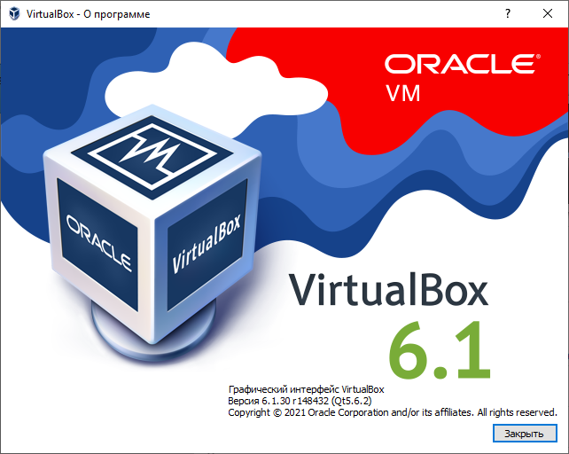
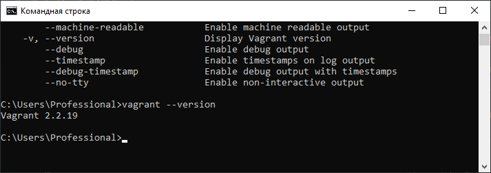
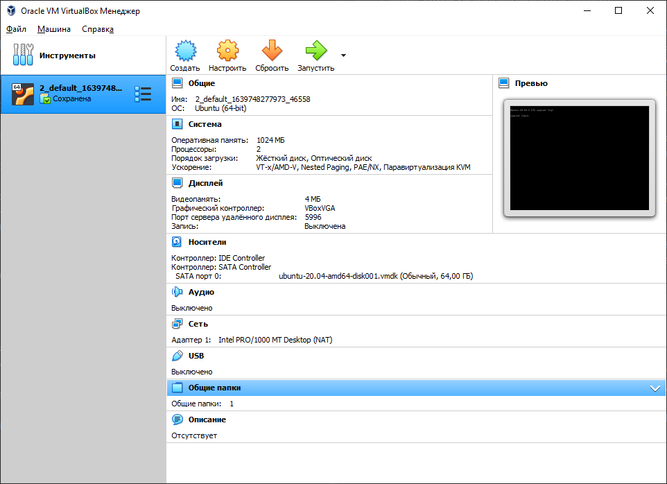
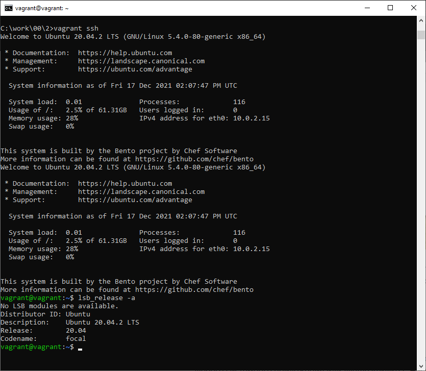

# Домашнее задание к занятию "3.1. Работа в терминале, лекция 1"

1. Установите средство виртуализации [Oracle VirtualBox](https://www.virtualbox.org/).


2. Установите средство автоматизации [Hashicorp Vagrant](https://www.vagrantup.com/).



3. В вашем основном окружении подготовьте удобный для дальнейшей работы терминал. Можно предложить:
    Несколько популярных проблем: 
    * Добавьте Vagrant в правила исключения перехватывающих трафик для анализа антивирусов, таких как Kaspersky, если у вас возникают связанные с SSL/TLS ошибки,
    * MobaXterm может конфликтовать с Vagrant в Windows,
    * Vagrant плохо работает с директориями с кириллицей (может быть вашей домашней директорией), тогда можно либо изменить [VAGRANT_HOME](https://www.vagrantup.com/docs/other/environmental-variables#vagrant_home), либо создать в системе профиль пользователя с английским именем,
    * VirtualBox конфликтует с Windows Hyper-V и его необходимо [отключить](https://www.vagrantup.com/docs/installation#windows-virtualbox-and-hyper-v),
    * [WSL2](https://docs.microsoft.com/ru-ru/windows/wsl/wsl2-faq#does-wsl-2-use-hyper-v-will-it-be-available-on-windows-10-home) использует Hyper-V, поэтому с ним VirtualBox также несовместим,
    * аппаратная виртуализация (Intel VT-x, AMD-V) должна быть активна в BIOS,
    * в Linux при установке [VirtualBox](https://www.virtualbox.org/wiki/Linux_Downloads) может дополнительно потребоваться пакет `linux-headers-generic` (debian-based) / `kernel-devel` (rhel-based).
>Проблемы учтены при работе  

4. С помощью базового файла конфигурации запустите Ubuntu 20.04 в VirtualBox посредством Vagrant:

    * Создайте директорию, в которой будут храниться конфигурационные файлы Vagrant. В ней выполните `vagrant init`. Замените содержимое Vagrantfile по умолчанию следующим:

        ```bash
        Vagrant.configure("2") do |config|
            config.vm.box = "bento/ubuntu-20.04"
        end
        ```

    * Выполнение в этой директории `vagrant up` установит провайдер VirtualBox для Vagrant, скачает необходимый образ и запустит виртуальную машину.
>C:\work\00\2>vagrant up  
Bringing machine 'default' up with 'virtualbox' provider...  
==> default: Importing base box 'bento/ubuntu-20.04'...  
==> default: Matching MAC address for NAT networking...  
==> default: Checking if box 'bento/ubuntu-20.04' version '202107.28.0' is up to date...  
==> default: Setting the name of the VM: 2_default_1639748277973_46558  
==> default: Clearing any previously set network interfaces...  
==> default: Preparing network interfaces based on configuration...  
    default: Adapter 1: nat  
==> default: Forwarding ports...  
    default: 22 (guest) => 2222 (host) (adapter 1)  
==> default: Booting VM...  
==> default: Waiting for machine to boot. This may take a few minutes...  
    default: SSH address: 127.0.0.1:2222  
    default: SSH username: vagrant  
    default: SSH auth method: private key  
    default: Warning: Connection reset. Retrying...  
    default: Warning: Connection aborted. Retrying...  
    default:  
    default: Vagrant insecure key detected. Vagrant will automatically replace  
    default: this with a newly generated keypair for better security.  
    default:  
    default: Inserting generated public key within guest...  
    default: Removing insecure key from the guest if it's present...  
    default: Key inserted! Disconnecting and reconnecting using new SSH key...  
==> default: Machine booted and ready!  
==> default: Checking for guest additions in VM...  
==> default: Mounting shared folders...  
    default: /vagrant => C:/work/00/2    

   * `vagrant suspend` выключит виртуальную машину с сохранением ее состояния (т.е., при следующем `vagrant up` будут запущены все процессы внутри, которые работали на момент вызова suspend), `vagrant halt` выключит виртуальную машину штатным образом.

>C:\work\00\2>vagrant suspend  
==> default: Saving VM state and suspending execution...  

5. Ознакомьтесь с графическим интерфейсом VirtualBox, посмотрите как выглядит виртуальная машина, которую создал для вас Vagrant, какие аппаратные ресурсы ей выделены. Какие ресурсы выделены по-умолчанию?


>RAM:1024mb  
CPU:2 cpu  
HDD:64gb  
video:4mb  

6. Ознакомьтесь с возможностями конфигурации VirtualBox через Vagrantfile: [документация](https://www.vagrantup.com/docs/providers/virtualbox/configuration.html). Как добавить оперативной памяти или ресурсов процессора виртуальной машине?

>`
Изменить память и количество ЦПУ  
Изменить файл конфигурации на   
 Vagrant.configure("2") do |config|    
    config.vm.provider "virtualbox" do |v|    
        v.memory = 512  
        v.cpus = 2  
    end  
end  
Vagrant.configure("2") do |config|  
 	config.vm.box = "bento/ubuntu-20.04"  
 end  

7. Команда `vagrant ssh` из директории, в которой содержится Vagrantfile, позволит вам оказаться внутри виртуальной машины без каких-либо дополнительных настроек. Попрактикуйтесь в выполнении обсуждаемых команд в терминале Ubuntu.


8. Ознакомиться с разделами `man bash`, почитать о настройках самого bash:
     * переменной HISTFILESIZE можно задать длину журнала `history`  
     >на line 846 manual  описывается HISTFILESIZE, можно задать длину журнала `history`.
     * что делает директива `ignoreboth` в bash?   
    >решение `ignoreboth`- не записывать команду, которая начинается с пробела, либо команду, которая дублирует предыдущую  
9. В каких сценариях использования применимы скобки `{}` и на какой строчке `man bash` это описано?  
 >{} список, line man bash 257.  

10. Основываясь на предыдущем вопросе, как создать однократным вызовом `touch` 100000 файлов? А получилось ли создать 300000? Если нет, то почему?
`touch` 100000 файлов-  >`touch {1..1000}`  
`touch` 300000 не получиться создать из-за ограничения дины командной строки  >`getconf ARG_MAX -2097152`    
    
11. В man bash поищите по `/\[\[`. Что делает конструкция `[[ -d /tmp ]]`
Конструкция `[[ -d /tmp ]]`проверяет условие у -d /tmp (наличие каталога /tmp) и возвращает ее статус (0 или 1)  
IF ветвления.  

12. Основываясь на знаниях о просмотре текущих (например, PATH) и установке новых переменных; командах, которые мы рассматривали, добейтесь в выводе type -a bash в виртуальной машине наличия первым пунктом в списке:

     ```bash
     bash is /tmp/new_path_directory/bash
     bash is /usr/local/bin/bash
     bash is /bin/bash
     ```
     (прочие строки могут отличаться содержимым и порядком)
     В качестве ответа приведите команды, которые позволили вам добиться указанного вывода или соответствующие скриншоты.

>vagrant@vagrant:~$ mkdir /tmp/new_path_directory/  
vagrant@vagrant:~$ cp /bin/bash /tmp/new_path_directory/      
vagrant@vagrant:~$ type -a bash   
bash is /usr/bin/bash  
bash is /bin/bash  
vagrant@vagrant:~$ PATH=/tmp/new_path_directory/:$PATH  
vagrant@vagrant:~$ type -a bash  
bash is /tmp/new_path_directory/bash  
bash is /usr/bin/bash  
bash is /bin/bash  
vagrant@vagrant:~$  


13. Чем отличается планирование команд с помощью `batch` и `at`?
Решение   
>at - команда запускается в указанное время (в параметре)  
batch - запускается когда уровень загрузки системы снизится ниже 1.5.

15. Завершите работу виртуальной машины чтобы не расходовать ресурсы компьютера и/или батарею ноутбука.  
>Выполнено

 
